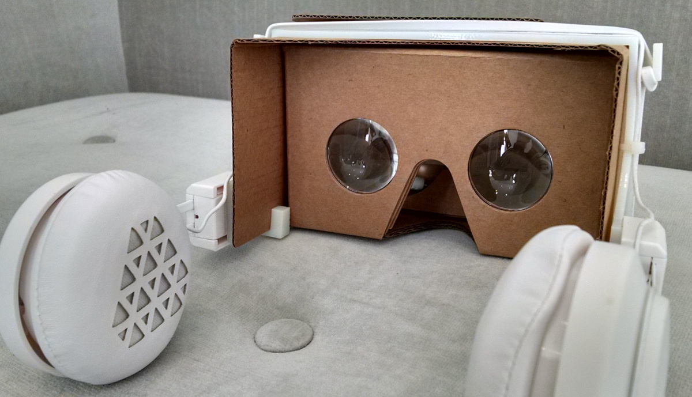

# Cardboard headphones:  DIY headphones for Cardboard VR viewers

[ more photos](https://goo.gl/photos/ggecJdJPGQ1fHz2C6 "Go to photo gallery")

**Immersive audio for Cardboard VR without sacrificing easy on & off**

Google Cardboard is great-- a simple VR experience that's easily shared.  Hand it to friends or relatives and watch them be amazed.  But things get complicated when you want to include audio in the experience:  it's awkward to exchange the headphones and viewer without dropping something, getting cords tangled, or defeating the spatialized sound goodness by crossing the left and right channels.  In the spirit of Google's Cardboard, **_Cardboard headphones_** enables VR with immersive audio that is accessible, low cost, and can be worn and removed effortlessly.

|Related news
|------------
|[Spatial audio comes to the Cardboard SDK](http://googledevelopers.blogspot.com/2016/01/spatial-audio-comes-to-cardboard-sdk.html)— you're using your viewer with headphones, right?

## What is this project exactly?

Intended for do-it-yourself types, this project publishes the design for a 3D printed part which mates off-the-shelf headphones to the Cardboard viewer.  *Cardboard headphones* attaches easily to the VR viewer, has adjustable ear depth, folds, accommodates cord slack, and supports phones with top or bottom headphone jack placement.

## What Cardboard VR viewers will this work with?

The headphone frame is designed for the "New Cardboard" VR viewer which Google gave away at their I/O 2015 event and subsequently open-sourced.  Several manufacturers offer viewers based on this design— see the first row of viewers listed at [Get Cardboard](https://www.google.com/get/cardboard/get-cardboard/) (i.e. Knox V2, I AM CARDBOARD V2, and Unofficial Cardboard 2.0).

## What headphones will this work with?

The current design is for a specific pair of JLab Audio on-ear headphones (INTRO model), available for about 20 USD.  Several factors went into selecting this model among tested candidates:  price and availability, sound quality, ease of hacking, slack between left/right ear connection, comfort, and adjustability.  You may find these headphones have a marginal volume level due to their high impedance-- and fidelity could be better-- but they work well considering all the factors.

Of course if you're handy with 3D modeling, feel free to customize the design for other headphones.  Please share your results!

## Deliverables

* [Frame STL file](v2_jlab_intro/cardboard_headphones_frame.stl) (for 3D printing)
* [Assembly instructions](v2_jlab_intro/assembly.md)
* [Frame source model](https://tinkercad.com/things/i3NaLufb8T3) (hosted at Tinkercad)

## Disclaimers

No guarantee is made that the design will work with your headphones and viewer.  Modifying your headphones as described will void your manufacturer's warranty.  *_Cardboard headphones_* is not a Google project.
